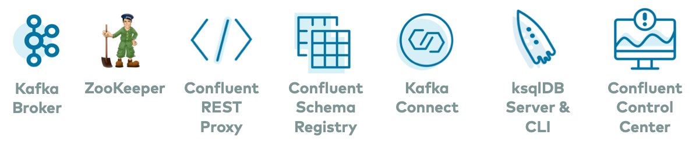

# Kafka Connect Stack with Integration Tests

[](https://dl.circleci.com/status-badge/redirect/gh/bazzani/kafka-connect-stack/tree/develop)

[](https://sonarcloud.io/summary/new_code?id=bazzani_kafka-connect-stack)
[](https://sonarcloud.io/summary/new_code?id=bazzani_kafka-connect-stack)
[](https://sonarcloud.io/summary/new_code?id=bazzani_kafka-connect-stack)
[](https://sonarcloud.io/summary/new_code?id=bazzani_kafka-connect-stack)
[](https://sonarcloud.io/summary/new_code?id=bazzani_kafka-connect-stack)
[](https://sonarcloud.io/summary/new_code?id=bazzani_kafka-connect-stack)

<!-- TOC -->
* [Kafka Connect Stack with Integration Tests](#kafka-connect-stack-with-integration-tests)
  * [TL;DR](#tldr)
  * [Project purpose](#project-purpose)
  * [Continuous Integration](#continuous-integration)
    * [Circle CI](#circle-ci)
    * [SonarCloud](#sonarcloud)
  * [Project structure](#project-structure)
  * [How do I extend this project?](#how-do-i-extend-this-project)
  * [Technologies Used](#technologies-used)
  * [Docker Compose stack](#docker-compose-stack)
      * [Ports](#ports)
  * [Integration Tests](#integration-tests)
      * [Container logs](#container-logs)
      * [Running Integration tests once](#running-integration-tests-once)
  * [JaCoCo coverage](#jacoco-coverage)
  * [TODOs](#todos)
<!-- TOC -->

## TL;DR

If you want to learn how to run Kafka Connect, create a custom SMT, and test a Connector is working end to end in your
local environment with automated tests asserting on data in the Database..._\*gasps for air\*_ :open_mouth:... this
project is for you; read on...

> [!TIP]
> Run `./gradlew build` to build the project including running the integration tests. Afterward you can check the code
> coverage and container logs, _more details about where to find them below_.

> [!NOTE]
> The Docker Compose stack used in this project is a variant of the Confluent `cp-all-in-one` stack found
> at https://github.com/confluentinc/cp-all-in-one/tree/7.6.0-post

---

## Project purpose

The purpose of this project is to help a developer understand how to use:

1. [Kafka Connect](https://docs.confluent.io/platform/current/connect/index.html) :: Run a Docker Compose stack with all
   dependant services a Kafka Connect instance needs
2. [Single Message Transforms](https://docs.confluent.io/platform/current/connect/index.html#connect-transforms) ::
   Develop custom Kafka Connect SMTs and build a jar library
3. [Kafka Connect Docker Image](https://hub.docker.com/r/confluentinc/cp-server-connect-base) :: Build a Docker image
   based on `confluentinc/cp-server-connect-base`
4. [Auto Connector creation](https://developer.confluent.io/courses/kafka-connect/rest-api/#create-a-connector-instance) ::
   Add Connector configs to docker image, created at startup with
   a [custom script](connect-scripts/create-connectors.sh)
5. [JDBCSinkConnector](https://docs.confluent.io/kafka-connectors/jdbc/current/sink-connector/overview.html) :: Create
   a [Kafka Connect Connector](https://docs.confluent.io/platform/current/connect/index.html#connectors) to move data
   from a Kafka Topic to a Database
6. [Gradle Multi-Project structure](https://docs.gradle.org/current/userguide/intro_multi_project_builds.html) ::
   Separate our SMT library code and the Spring Boot application/tests
7. [Spring Boot](https://docs.spring.io/spring-boot/)
   and [@SpringBootTest](https://www.baeldung.com/spring-boot-testing#integration-testing-with-springboottest) ::
   Produce a Kafka record on a topic and read from a Database with JPA
8. [Integration Tests](https://docs.gradle.org/current/userguide/java_testing.html#sec:configuring_java_integration_tests) ::
   Run a single Gradle command to ensure our Connector/SMTs are working end-to-end
9. [gradle-docker-compose-plugin](https://github.com/avast/gradle-docker-compose-plugin) :: Start and stop the full
   stack of Docker Compose services using Gradle
10. [JaCoCo Report Aggregation Plugin](https://docs.gradle.org/current/userguide/jacoco_report_aggregation_plugin.html) ::
    Get code coverage stats from subprojects in a single HTML/XML report

---

## Continuous Integration

### Circle CI

[](https://dl.circleci.com/status-badge/redirect/gh/bazzani/kafka-connect-stack/tree/develop)

Every commit pushed to git is built by Circle CI to ensure the integration tests still pass,
and [SonarCloud analysis](#sonarcloud) is run if possible (_see `SONAR_TOKEN` requirement below_). You can see the
Circle CI build configuration in the [.circleci/config.yml](.circleci/config.yml) file.

The Gradle dependencies are cached based on a checksum of all the `build.gradle` files, which can speed up the builds
significantly; see more at the [Caching dependencies](https://circleci.com/docs/caching) page.

After the build has finished, the test results can be found in the `Tests` tab of the build job; see more at
the [Collect test data](https://circleci.com/docs/collect-test-data/#gradle-junit-test-results) page.

The test html reports, JaCoCo aggregate report and connect container logs can be found in the `Artifacts` tab of the
build job. The log file can be useful to check if integration tests fail; see more at
the [Storing build artifacts](https://circleci.com/docs/artifacts/) page.

### SonarCloud

[](https://sonarcloud.io/summary/new_code?id=bazzani_kafka-connect-stack)

[SonarCloud](https://docs.sonarsource.com/sonarcloud/discovering-sonarcloud/developing-with-sonar/) helps to keep the
codebase clean by reporting on several metrics such as issues (_problems in code where rules are violated_), code
coverage, and technical debt.

The `sonar` Gradle task will only run if the `SONAR_TOKEN` environment
variable is present, which makes the build more robust in different
environments. Circle CI has the token applied, so it will run there.

> [!IMPORTANT]
> If you fork this repo and want to be able to run SonarCloud analysis you will need to change the `projectKey` and
> `organization` sonar properties to point to your own project, they can be found in the root
> [build.gradle](build.gradle#L15-L16).

---

## Project structure

The code in this project is split into a few Gradle Multi-Projects with dependencies between them. Best practises from
the [Gradle User Manual](https://docs.gradle.org/current/userguide/about_manual.html) have been
followed:

| Project Directory                                        | Description                                                                                                                                                                                                                                                                                                     |
|----------------------------------------------------------|-----------------------------------------------------------------------------------------------------------------------------------------------------------------------------------------------------------------------------------------------------------------------------------------------------------------|
| `Root project` &nbsp;                  | Contains Java Toolchain plugin in `settings.gradle`, and plugin definitions in `build.gradle` which are applied to subprojects (_this centralises the version numbers_).                                                                                                                                        |`
| [`buildSrc`](buildSrc)                                   | Contains [Gradle convention plugins](https://docs.gradle.org/current/userguide/sharing_build_logic_between_subprojects.html#sec:convention_plugins) to share build logic in sub projects.                                                                                                                       |
| [`connect-smt-lib`](connect-smt-lib)                     | Contains Java code and tests for [custom SMTs](https://docs.confluent.io/platform/current/connect/transforms/custom.html) that are exported to a jar library and added to the Kafka Connect Docker image at build time.                                                                                         |
| [`connect-spring-boot-app`](connect-spring-boot-app)     | Contains Java code which uses Spring Boot, Spring Kafka, Spring Data JPA, and `@SpringBootTest` to run end to end integration tests with the help of some Grade plugins to control the Docker Compose stack.                                                                                                    |
| [`jacoco-report-aggregation`](jacoco-report-aggregation) | Contains Gradle build logic to run a plugin which aggregates all JaCoCo execution data and creates a consolidated HTML/XML report with coverage data for all subprojects.                                                                                                                                       |
|                                                          |                                                                                                                                                                                                                                                                                                                 |
| [_connect-connector-configs_](connect-connector-configs) | Contains Kafka Connect connector configurations in JSON format.  Each JSON file is processed by the Kafka Connect container at startup to create a connector automatically once the [REST API](https://docs.confluent.io/platform/7.6/connect/references/restapi.html#connectors) is ready to receive requests. |
| [_connect-scripts_](connect-scripts)                     | Contains custom bash scripts to start the Connect service with the Confluent startup script, wait for the REST API to be available, then create connectors automatically.                                                                                                                                       |    
| [_db_](db)                                               | Contains SQL scripts run by the `postgres` service on startup; we usually add `CREATE TABLE` definitions in these scripts.                                                                                                                                                                                      |

---

## How do I extend this project?

The objective of this project is to allow you to easily add your own SMTs and use them in Connectors.

If you want to do this follow these steps:

1. Add a new SMT to the [connect-smt-lib](connect-smt-lib/src/main/java/com/bevans/kafka/connect/transforms) module
    - :pencil: _don't forget to add a unit test too!_
2. Add a new connector config to the [connect-connector-configs](connect-connector-configs) directory
    - :pencil:It will automatically get detected at container startup and the connector will be created
    - :bulb: Keep an eye on the container logs at startup to ensure your connector config is valid
    - :bulb: Or use the Confluent Control Center UI to add a connector by uploading the json file
3. Add an AVRO schema for the new record/topic [here](connect-spring-boot-app/src/integration/resources/avro)
4. Add an AVRO JSON data file for the new
   record/topic [here](connect-spring-boot-app/src/integration/resources/avro-data)
5. If you are adding a new `JDBCSinkConnector`
    1. Add a new Database table definition to the [db](db) directory
    2. Add a new Entity for the new DB
       Table [here](connect-spring-boot-app/src/main/java/com/bevans/kafka/connect/springboot/data/entity)
    3. Add a new JPA Repository for the
       entity [here](connect-spring-boot-app/src/main/java/com/bevans/kafka/connect/springboot/data)
6. Add a new Creator class to map AVRO data to a `GenericData.Record` based
   on [FFVIIAllyUpdateCreator](connect-spring-boot-app/src/integration/java/com/bevans/kafka/connect/springboot/ffvii/FFVIIAllyUpdateCreator.java)
7. Add a `@SpringBootTest` integration test for the new connector based
   on [FFVIIAllyUpdateTest](connect-spring-boot-app/src/integration/java/com/bevans/kafka/connect/springboot/FFVIIAllyUpdateTest.java)
8. Run the integration tests `./gradlew integrationTest`

---

## Technologies Used

1. Java 17 - [Used by Gradle](buildSrc/src/main/groovy/bevans.java-conventions.gradle#L17) to build the Java code/tests,
   and
   it is the [JRE running](Dockerfile#L7-L13) inside the Connect container
2. Gradle Wrapper - The project contains
   a [Gradle Wrapper](https://docs.gradle.org/current/userguide/gradle_wrapper.html) to execute the build
    - _The Gradle installation will be downloaded the first time you run the wrapper_
3. Docker & Docker Compose - to build Docker images and run containers in the stack
    - [Install Docker Desktop on Mac](https://docs.docker.com/desktop/install/mac-install/)
    - [Install Docker Desktop on Windows](https://docs.docker.com/desktop/install/windows-install/)
4. Postgres Database - to store data from Kafka Connect

> [!IMPORTANT]
> _Please ensure you have Java 17 set as your **Java Home**, otherwise you will get errors like this:_

```
FAILURE: Build failed with an exception.

* What went wrong:
A problem occurred configuring root project 'kafka-connect-stack'.
> Could not resolve all artifacts for configuration ':classpath'.
  > Could not resolve org.springframework.boot:spring-boot-gradle-plugin:3.2.4.
    Required by:
        project : > org.springframework.boot:org.springframework.boot.gradle.plugin:3.2.4
    > No matching variant of org.springframework.boot:spring-boot-gradle-plugin:3.2.4 was found.
       The consumer was configured to find a library for use during runtime, compatible with
       Java 11, packaged as a jar, and its dependencies declared externally, as well as attribute
       'org.gradle.plugin.api-version' with value '8.7' but:
    - Variant 'apiElements' declares a library, packaged as a jar, and its dependencies declared
      externally:
    - Incompatible because this component declares a component for use during compile-time,
      compatible with Java 17 and the consumer needed a component for use during runtime,
      compatible with Java 11
    - Other compatible attribute:
    - Doesn't say anything about org.gradle.plugin.api-version (required '8.7')
```

---

## Docker Compose stack

The Docker Compose stack used in this project is a variant of the Confluent `cp-all-in-one` stack found
at https://github.com/confluentinc/cp-all-in-one/tree/7.6.0-post
> [!NOTE]
> 
> image source: https://github.com/confluentinc/cp-all-in-one/blob/7.6.0-post/images/cp-all-in-one-community.png

> [!TIP]
> You can start the stack by running the docker compose command below, but we recommend you use
> the [gradle-docker-compose-plugin](https://github.com/avast/gradle-docker-compose-plugin)
> task `./gradlew intTestComposeUp` to start it as it will also build the Connect image if the SMT library or
> connector configs have changed in any way.

```shell
docker compose up -d --build
```

#### Ports

To connect to services in Docker, refer to the following ports:

| Service                   | Port                          | Notes                                                                                                          |
|---------------------------|-------------------------------|----------------------------------------------------------------------------------------------------------------|
| ZooKeeper                 | 2181                          |                                                                                                                |
| Kafka broker              | 9092                          |                                                                                                                |
| Kafka broker JMX          | 9101                          |                                                                                                                |
| Confluent Schema Registry | [8081](http://localhost:8081) | [Schema Registry API Reference](https://docs.confluent.io/platform/7.6/schema-registry/develop/api.html)       |
| Kafka Connect             | [8083](http://localhost:8083) | [Kafka Connect Rest API documentation](https://docs.confluent.io/platform/7.6/connect/references/restapi.html) |
| Confluent Control Center  | [9021](http://localhost:9021) | [Confluent Control Center documentation](https://docs.confluent.io/platform/7.6/control-center/index.html)     |
| ksqlDB                    | 8088                          |                                                                                                                |
| Confluent REST Proxy      | [8082](http://localhost:8082) | [API Reference for Confluent REST Proxy](https://docs.confluent.io/platform/7.6/kafka-rest/api.html)           |

The most useful service is the Confluent Control Center which exposes a graphical user interface
at [http://localhost:9021/clusters/](http://localhost:9021/clusters) to manage various services including:

- the Kafka Broker
- Topics (_including producing and consuming records_)
- Consumers/Consumer groups
- Connectors running on the Kafka Connect service
- Schemas associated with topics (via the Schema Registry under the hood)
- use ksqlDB Streams, Tables, and queries

---

## Integration Tests

An `integrationTest` Gradle sourceSet has been added so that we can isolate the unit tests and the integration tests
(_the former completing in a much shorter time by running the standard `./gradlew test` task)_.

Running the `./gradlew check` gradle task will invoke the `integrationTest` task which has the following steps:

1. bring the Docker Compose stack up in a project named `kafka-connect-stack_inttest`
2. run the integration tests
3. bring the Docker Compose stack down
4. remove all the containers

> [!TIP]
> _This behaviour can be changed by using the various configuration properties of
> the [gradle-docker-compose-plugin](https://github.com/avast/gradle-docker-compose-plugin#usage) such
> as `stopContainers` and `removeContainers`_

#### Container logs

After running the integration tests, you can view the logs for all the containers in
the [connect-spring-boot-app/build](connect-spring-boot-app/build/container-logs) directory.

If the integration tests fail :bug: , you might want to check
the [Kafka Connect container logs](connect-spring-boot-app/build/container-logs/connect.log) for errors on startup when
automatic connector creation happens, or when a connector tried to process a record and failed.

#### Running Integration tests once

As mentioned above all containers are stopped and removed after the integration tests have finished running, which is
useful when running them on a CI server. It is possible to run the integration tests without stopping and removing all
the Docker containers in the stack which is more suited to local development.

This is useful if you are making frequent changes to the tests, the underlying Spring Boot application, or even the
SMTs in the `connect-smt-lib` library/connector configurations (_making changes to the latter will force the
`connect` container to be recreated, which is desirable_).

- To do this run `./gradlew integrationTestRun`

> [!TIP]
> Exclude the `intTestComposeUp` task to run the integration tests even faster by not checking if all containers are
> responding on the correct port before the tests are run.
>
> Skipping this check can be useful if we are only making changes to the tests, and not the SMTs, connector configs
> or the Kafka Connect Dockerfile.
> - To do this run `./gradlew integrationTestRun -x intTestComposeUp`

> [!NOTE]
> _making changes to any SMT library code or connector configs will recreate the Kafka Connect docker image via
> the `intTestComposeBuild` task, which is a dependant of `integrationTestRun`_.

---

## JaCoCo coverage

After running the `./gradlew check` task (included in `build`), you can find the aggregate report for
code in all the subprojects in the
[jacoco-report-aggregation/build](jacoco-report-aggregation/build/reports/jacoco/jacocoFullReport/html/index.html)
directory.

---

## TODOs

Some outstanding tasks to make the project more complete can be found [here](todo/README.md)
